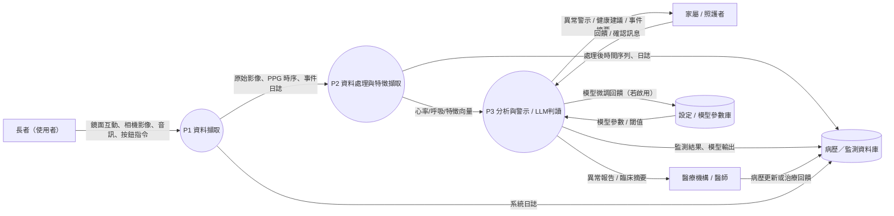

```mermaid

flowchart LR
  %% External entities
  Elderly[長者（使用者）]
  Caregiver[家屬 / 照護者]
  Medical[醫療機構 / 醫師]

  %% Processes (用圓形表示)
  P1((P1 資料擷取))
  P2((P2 資料處理與特徵擷取))
  P3((P3 分析與警示 / LLM判讀))

  %% Data stores (資料庫)
  DS1[(病歷／監測資料庫)]
  DS2[(設定 / 模型參數庫)]

  %% 資料流程
  Elderly -->|鏡面互動、相機影像、音訊、按鈕指令| P1
  P1 -->|原始影像、PPG 時序、事件日誌| P2
  P2 -->|心率/呼吸/特徵向量| P3
  P2 -->|處理後時間序列、日誌| DS1
  P3 -->|異常警示 / 健康建議 / 事件摘要| Caregiver
  P3 -->|異常報告 / 臨床摘要| Medical
  P3 -->|監測結果、模型輸出| DS1
  DS2 -->|模型參數 / 閾值| P3
  Caregiver -->|回饋 / 確認訊息| P3
  Medical -->|病歷更新或治療回饋| DS1
  P1 -->|系統日誌| DS1
  P3 -->|模型微調回饋（若啟用）| DS2
```
