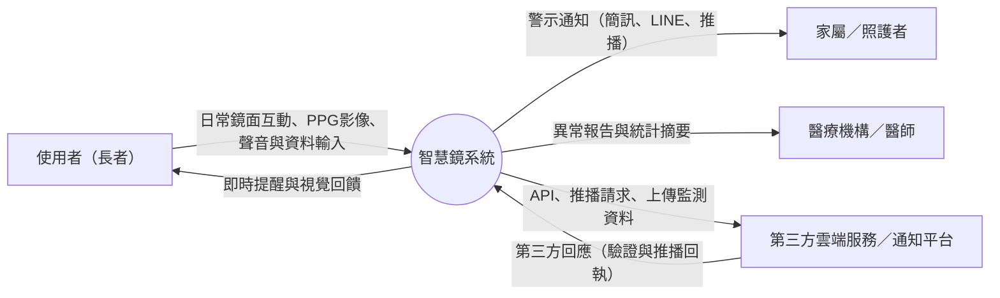
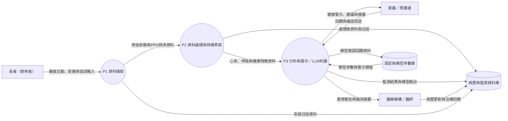

## 系統環境圖

```mermaid
flowchart LR
  %% External entities
  Elderly[使用者（長者）]
  Caregiver[家屬／照護者]
  Medical[醫療機構／醫師]
  Cloud[第三方雲端服務／通知平台]

  %% System as a single node
  System((智慧鏡系統))

  %% Flows
  Elderly -->|日常鏡面互動、PPG影像、聲音與資料輸入| System
  System -->|即時提醒與視覺回饋| Elderly
  System -->|警示通知（簡訊、LINE、推播）| Caregiver
  System -->|異常報告與統計摘要| Medical
  System -->|API、推播請求、上傳監測資料| Cloud
  Cloud -->|第三方回應（驗證與推播回執）| System

```

## 圖 0：智慧鏡系統資料流程圖

```mermaid

flowchart LR
  %% 外部實體
  Elderly[長者（使用者）]
  Caregiver[家屬／照護者]
  Medical[醫療機構／醫師]

  %% 處理程序
  P1((P1 資料擷取))
  P2((P2 資料處理與特徵萃取))
  P3((P3 分析與警示／LLM判讀))

  %% 資料庫
  DS1[(病歷與監測資料庫)]
  DS2[(設定與模型參數庫)]

  %% 資料流程
  Elderly -->|鏡面互動、影像與音訊輸入| P1
  P1 -->|原始影像與PPG時序資料| P2
  P2 -->|心率、呼吸與健康特徵資料| P3
  P2 -->|處理後資料與日誌| DS1
  P3 -->|健康警示、建議與摘要| Caregiver
  P3 -->|異常報告與臨床摘要| Medical
  P3 -->|監測結果與模型輸出| DS1
  DS2 -->|模型參數與警示閾值| P3
  Caregiver -->|回饋與確認訊息| P3
  Medical -->|病歷更新與治療回饋| DS1
  P1 -->|系統日誌資料| DS1
  P3 -->|模型微調回饋資料| DS2

```
