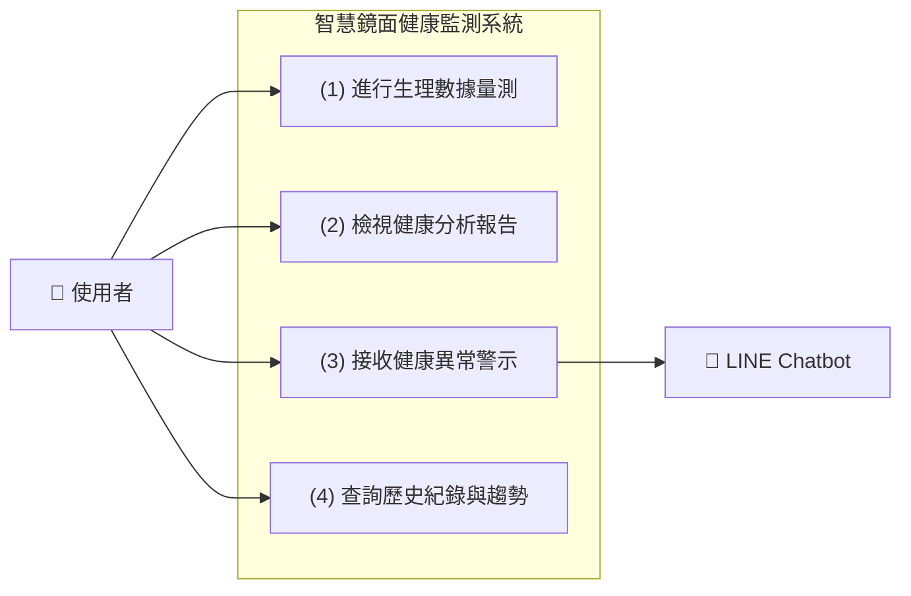

## 功能性需求

* **生理數據偵測功能**

> 智慧鏡可透過攝影鏡頭與PPG演算法，即時偵測使用者臉部血流變化，計算心率、血氧等健康指標。

* **健康分析與建議功能**

> 系統將收集的生理數據送入AI模型進行分析，再透過LLM模型產生淺顯易懂的健康說明，生成個人化健康分析報告，並提供改善建議或潛在健康風險提示。

* **警示與通知功能**

> 若系統偵測異常（如心率過高、血氧偏低），會即時發出健康警示，並透過LINE Chatbot傳送通知訊息給使用者/家屬。

* **歷史資料紀錄功能**

> 系統可儲存每次量測結果，供使用者在鏡面介面或LINE Chatbot中查看健康趨勢。

## 非功能性需求

* **即時性**

> 系統應能在5秒內完成數據量測，並進行健康數據分析與顯示，確保使用者獲得即時回饋。

* **準確性**

> PPG量測與LLM分析之誤差率應維持在可接受範圍（例如心率誤差±5%以內），確保健康建議可信度。

* **資料安全性**

> 使用者健康資料需經加密儲存與傳輸，避免個資外洩。

