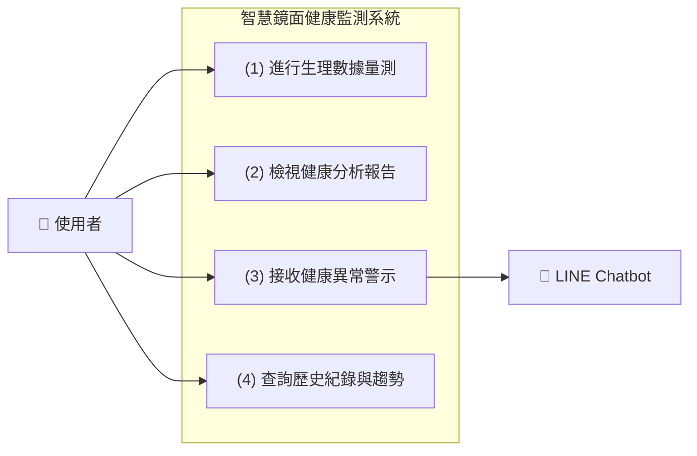
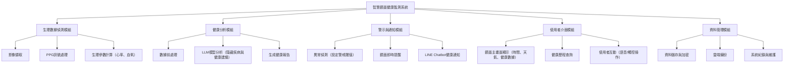

## 功能性需求

* **生理數據偵測功能**

> 智慧鏡可透過攝影鏡頭與PPG演算法，即時偵測使用者臉部血流變化，計算心率、血氧等健康指標。

* **健康分析與建議功能**

> 系統將收集的生理數據送入AI模型進行分析，再透過LLM模型產生淺顯易懂的健康說明，生成個人化健康分析報告，並提供改善建議或潛在健康風險提示。

* **警示與通知功能**

> 若系統偵測異常（如心率過高、血氧偏低），會即時發出健康警示，並透過LINE Chatbot傳送通知訊息給使用者/家屬。

* **歷史資料紀錄功能**

> 系統可儲存每次量測結果，供使用者在鏡面介面或LINE Chatbot中查看健康趨勢。

## 非功能性需求

* **即時性**

> 系統應能在5秒內完成數據量測，並進行健康數據分析與顯示，確保使用者獲得即時回饋。

* **準確性**

> PPG量測與LLM分析之誤差率應維持在可接受範圍（例如心率誤差±5%以內），確保健康建議可信度。

* **資料安全性**

> 使用者健康資料需經加密儲存與傳輸，避免個資外洩。

## 使用案例說明
### （一）生理數據偵測（PPG影像量測）

* **主要參與者**
 > 一般成人或長者

* **利害關係人及目標**

>使用者：希望能在日常照鏡時，自動獲得心率、血氧等健康數據。
>
>系統：透過鏡頭與PPG演算法進行非接觸式量測，快速取得準確結果。

* **前置條件**

>使用者站在智慧鏡前方，距離及光線符合量測條件。
>
>鏡面系統與感測模組正常運作。

* **主要流程**

>1. 使用者站立於鏡面前。
>   
>2. 系統啟動鏡頭與PPG演算法。
>   
>3. 系統偵測臉部血流變化，分析心率與血氧。
>   
>4. 鏡面即時顯示量測結果。
>   
>5. 系統暫存此次量測數據。

* **例外流程**

>若使用者晃動或光線不足，系統會提示重新量測。

* **後置條件**

>本次量測數據被記錄於雲端資料庫，供後續分析與趨勢追蹤使用。

### (二）健康分析與建議（AI+LLM）
* **主要參與者**

>系統（AI模型、LLM模組）

* **利害關係人及目標**

>使用者：希望了解自身健康狀況與改善建議。
>
>系統：分析多次量測結果，提供個人化健康回饋。

* **前置條件**

>系統已完成一次或多次生理數據量測。

* **主要流程**

>1. 系統將量測結果送入AI健康分析模型
>   
>2. 模型根據歷史資料與使用者個人特徵進行比較分析。
>   
>3. LLM模組生成自然語言的健康報告與建議。
>   
>4. 鏡面與LINE Chatbot同步顯示分析結果。

* **例外流程**

>若AI分析資料缺失或異常，系統顯示「分析中斷，請稍後再試」。

* **後置條件**

>個人健康報告被儲存，可供後續比對與長期趨勢分析。

### （三）異常警示與通知
* **主要參與者**

>系統（通知模組）、使用者、家屬

* **利害關係人及目標**

>使用者：能即時得知自身異常狀況。
>
>家屬：能在第一時間掌握健康警訊。
>
>系統：在偵測到異常後，迅速發出通知以降低健康風險。

* **前置條件**

>系統偵測到心率、血氧或其他指標異常。
>
>使用者及家屬已完成LINE帳號綁定。

* **主要流程**

>1. 系統分析結果顯示異常。
>   
>2. 系統自動觸發警示機制。
>    
>3. 鏡面顯示紅色警示訊息。
>   
>4. 系統透過LINE Chatbot發送通知給使用者及家屬。
>   
>5. 家屬可點擊訊息查看詳細報告或建議。

* **例外流程**

>若LINE服務中斷，警示僅顯示於鏡面並暫存至系統。

* **後置條件**

>系統紀錄異常事件與通知時間，供後續醫療追蹤參考。

## 功能分解圖（Functional Decomposition Diagram, FDD）

