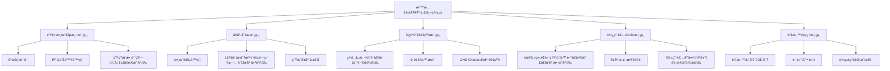

## 功能性需求

* **生ç†æ•¸æ“šåµæ¸¬åŠŸèƒ½**

> 智慧é¡å¯é€éæ”å½±é¡é ­èˆ‡PPG演算法，å³æ™‚åµæ¸¬ä½¿ç”¨è€…臉部血æµè®ŠåŒ–，計算心ç‡ã€è¡€æ°§ç­‰å¥åº·æŒ‡æ¨™ã€‚

* **å¥åº·åˆ†æ與建議功能**

> 系統將收集的生ç†æ•¸æ“šé€å…¥AI模å‹é€²è¡Œåˆ†æ，å†é€éLLM模å‹ç”¢ç”Ÿæ·ºé¡¯æ˜“懂的å¥åº·èªªæ˜ï¼Œç”Ÿæˆå€‹äººåŒ–å¥åº·åˆ†æ報告，並æ供改善建議或潛在å¥åº·é¢¨éšªæ示。

* **警示與通知功能**

> 若系統åµæ¸¬ç•°å¸¸ï¼ˆå¦‚心ç‡é高ã€è¡€æ°§åä½ï¼‰ï¼Œæœƒå³æ™‚發出å¥åº·è­¦ç¤ºï¼Œä¸¦é€éLINE Chatbot傳é€é€šçŸ¥è¨Šæ¯çµ¦ä½¿ç”¨è€…/家屬。

* **æ­·å²è³‡æ–™ç´€éŒ„功能**

> 系統å¯å„²å­˜æ¯æ¬¡é‡æ¸¬çµæœï¼Œä¾›ä½¿ç”¨è€…在é¡é¢ä»‹é¢æˆ–LINE Chatbot中查看å¥åº·è¶¨å‹¢ã€‚

## é功能性需求

* **å³æ™‚性**

> 系統應能在5秒內完æˆæ•¸æ“šé‡æ¸¬ï¼Œä¸¦é€²è¡Œå¥åº·æ•¸æ“šåˆ†æ與顯示，確ä¿ä½¿ç”¨è€…ç²å¾—å³æ™‚å›é¥‹ã€‚

* **準確性**

> PPGé‡æ¸¬èˆ‡LLM分æ之誤差ç‡æ‡‰ç¶­æŒåœ¨å¯æ¥å—範åœï¼ˆä¾‹å¦‚心ç‡èª¤å·®Â±5%以內），確ä¿å¥åº·å»ºè­°å¯ä¿¡åº¦ã€‚

* **資料安全性**

> 使用者å¥åº·è³‡æ–™éœ€ç¶“加密儲存與傳輸，é¿å…個資外洩。

## 使用案例說æ˜
### （一）生ç†æ•¸æ“šåµæ¸¬ï¼ˆPPGå½±åƒé‡æ¸¬ï¼‰

* **主è¦åƒèˆ‡è€…**
 > 一般æˆäººæˆ–長者

* **利害關係人åŠç›®æ¨™**

>使用者：希望能在日常照é¡æ™‚，自動ç²å¾—心ç‡ã€è¡€æ°§ç­‰å¥åº·æ•¸æ“šã€‚
>
>系統：é€éé¡é ­èˆ‡PPG演算法進行éæ¥è§¸å¼é‡æ¸¬ï¼Œå¿«é€Ÿå–得準確çµæœã€‚

* **å‰ç½®æ¢ä»¶**

>使用者站在智慧é¡å‰æ–¹ï¼Œè·é›¢åŠå…‰ç·šç¬¦åˆé‡æ¸¬æ¢ä»¶ã€‚
>
>é¡é¢ç³»çµ±èˆ‡æ„Ÿæ¸¬æ¨¡çµ„正常é‹ä½œã€‚

* **主è¦æµç¨‹**

>1. 使用者站立於é¡é¢å‰ã€‚
>   
>2. 系統啟動é¡é ­èˆ‡PPG演算法。
>   
>3. 系統åµæ¸¬è‡‰éƒ¨è¡€æµè®ŠåŒ–，分æ心ç‡èˆ‡è¡€æ°§ã€‚
>   
>4. é¡é¢å³æ™‚顯示é‡æ¸¬çµæœã€‚
>   
>5. 系統暫存此次é‡æ¸¬æ•¸æ“šã€‚

* **例外æµç¨‹**

>若使用者晃動或光線ä¸è¶³ï¼Œç³»çµ±æœƒæ示é‡æ–°é‡æ¸¬ã€‚

* **後置æ¢ä»¶**

>本次é‡æ¸¬æ•¸æ“šè¢«è¨˜éŒ„於雲端資料庫，供後續分æ與趨勢追蹤使用。

### (二）å¥åº·åˆ†æ與建議（AI+LLM）
* **主è¦åƒèˆ‡è€…**

>系統（AI模å‹ã€LLM模組）

* **利害關係人åŠç›®æ¨™**

>使用者：希望了解自身å¥åº·ç‹€æ³èˆ‡æ”¹å–„建議。
>
>系統：分æ多次é‡æ¸¬çµæœï¼Œæ供個人化å¥åº·å›é¥‹ã€‚

* **å‰ç½®æ¢ä»¶**

>系統已完æˆä¸€æ¬¡æˆ–多次生ç†æ•¸æ“šé‡æ¸¬ã€‚

* **主è¦æµç¨‹**

>1. 系統將é‡æ¸¬çµæœé€å…¥AIå¥åº·åˆ†æ模å‹
>   
>2. 模å‹æ ¹æ“šæ­·å²è³‡æ–™èˆ‡ä½¿ç”¨è€…個人特徵進行比較分æ。
>   
>3. LLM模組生æˆè‡ªç„¶èªè¨€çš„å¥åº·å ±å‘Šèˆ‡å»ºè­°ã€‚
>   
>4. é¡é¢èˆ‡LINE ChatbotåŒæ­¥é¡¯ç¤ºåˆ†æçµæœã€‚

* **例外æµç¨‹**

>è‹¥AI分æ資料缺失或異常，系統顯示「分æ中斷，請ç¨å¾Œå†è©¦ã€ã€‚

* **後置æ¢ä»¶**

>個人å¥åº·å ±å‘Šè¢«å„²å­˜ï¼Œå¯ä¾›å¾ŒçºŒæ¯”å°èˆ‡é•·æœŸè¶¨å‹¢åˆ†æ。

### （三）異常警示與通知
* **主è¦åƒèˆ‡è€…**

>系統（通知模組）ã€ä½¿ç”¨è€…ã€å®¶å±¬

* **利害關係人åŠç›®æ¨™**

>使用者：能å³æ™‚得知自身異常狀æ³ã€‚
>
>家屬：能在第一時間æŒæ¡å¥åº·è­¦è¨Šã€‚
>
>系統：在åµæ¸¬åˆ°ç•°å¸¸å¾Œï¼Œè¿…速發出通知以é™ä½å¥åº·é¢¨éšªã€‚

* **å‰ç½®æ¢ä»¶**

>系統åµæ¸¬åˆ°å¿ƒç‡ã€è¡€æ°§æˆ–其他指標異常。
>
>使用者åŠå®¶å±¬å·²å®ŒæˆLINE帳號ç¶å®šã€‚

* **主è¦æµç¨‹**

>1. 系統分æçµæœé¡¯ç¤ºç•°å¸¸ã€‚
>   
>2. 系統自動觸發警示機制。
>    
>3. é¡é¢é¡¯ç¤ºç´…色警示訊æ¯ã€‚
>   
>4. 系統é€éLINE Chatbot發é€é€šçŸ¥çµ¦ä½¿ç”¨è€…åŠå®¶å±¬ã€‚
>   
>5. 家屬å¯é»æ“Šè¨Šæ¯æŸ¥çœ‹è©³ç´°å ±å‘Šæˆ–建議。

* **例外æµç¨‹**

>è‹¥LINEæœå‹™ä¸­æ–·ï¼Œè­¦ç¤ºåƒ…顯示於é¡é¢ä¸¦æš«å­˜è‡³ç³»çµ±ã€‚

* **後置æ¢ä»¶**

>系統紀錄異常事件與通知時間，供後續醫療追蹤åƒè€ƒã€‚

## 功能分解圖（Functional Decomposition Diagram, FDD）

```mermaid
%%{ init: { "flowchart": { "curve": "linear" } } }%%
flowchart TD
    A["智慧é¡é¢å¥åº·ç›£æ¸¬ç³»çµ±"]

    A --> B["生ç†æ•¸æ“šåµæ¸¬æ¨¡çµ„"]
    A --> C["å¥åº·åˆ†æ模組"]
    A --> D["警示與通知模組"]
    A --> E["使用者介é¢æ¨¡çµ„"]
    A --> F["資料管ç†æ¨¡çµ„"]

    %% 生ç†æ•¸æ“šåµæ¸¬æ¨¡çµ„
    B --> B1["å½±åƒæ“·å–"]
    B --> B2["PPG訊號處ç†"]
    B --> B3["生ç†åƒæ•¸è¨ˆç®—（心ç‡ã€è¡€æ°§ï¼‰"]

    %% å¥åº·åˆ†æ模組
    C --> C1["數據å‰è™•ç†"]
    C --> C2["LLM模å‹åˆ†æ（隱è—疾病與å¥åº·å»ºè­°ï¼‰"]
    C --> C3["生æˆå¥åº·å ±å‘Š"]

    %% 警示與通知模組
    D --> D1["異常åµæ¸¬ï¼ˆè¨­å®šè­¦æˆ’閾值）"]
    D --> D2["é¡é¢å³æ™‚æ醒"]
    D --> D3["LINE Chatbotå¥åº·é€šçŸ¥"]

    %% 使用者介é¢æ¨¡çµ„
    E --> E1["é¡é¢ä¸»ç•«é¢é¡¯ç¤ºï¼ˆæ™‚é–“ã€å¤©æ°£ã€å¥åº·æ•¸æ“šï¼‰"]
    E --> E2["å¥åº·æ­·ç¨‹æŸ¥è©¢"]
    E --> E3["使用者互動（èªéŸ³/觸æ§æ“作）"]

    %% 資料管ç†æ¨¡çµ„
    F --> F1["資料儲存與加密"]
    F --> F2["雲端備份"]
    F --> F3["系統紀錄與維護"]
```
## 使用案例圖（Use Case Diagram)

```mermaid
flowchart LR
    subgraph 系統["智慧é¡é¢å¥åº·ç›£æ¸¬ç³»çµ±"]
        A1["(1) 進行生ç†æ•¸æ“šé‡æ¸¬"]
        A2["(2) 檢視å¥åº·åˆ†æ報告"]
        A3["(3) æ¥æ”¶å¥åº·ç•°å¸¸è­¦ç¤º"]
        A4["(4) 查詢歷å²ç´€éŒ„與趨勢"]
    end

    U["👤 使用者"] --> A1
    U --> A2
    U --> A3
    U --> A4
    A3 --> L["💬 LINE Chatbot"]
```
