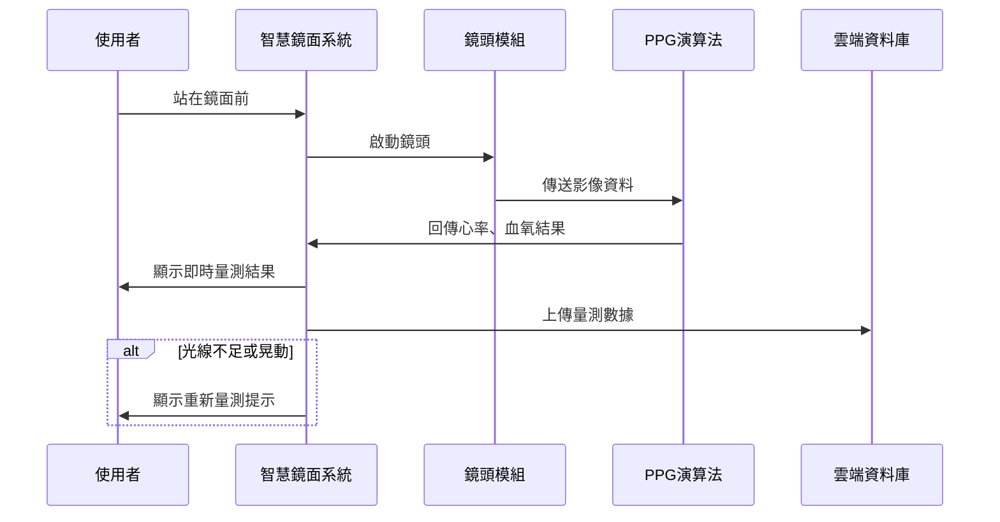
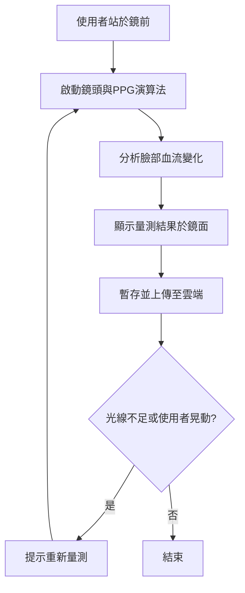

### 一、生理數據偵測（PPG影像量測）

```mermaid
sequenceDiagram
    participant User as 使用者
    participant Mirror as 智慧鏡面系統
    participant Camera as 鏡頭模組
    participant PPG as PPG演算法
    participant Cloud as 雲端資料庫

    User ->> Mirror: 站在鏡面前
    Mirror ->> Camera: 啟動鏡頭
    Camera ->> PPG: 傳送影像資料
    PPG ->> Mirror: 回傳心率、血氧結果
    Mirror ->> User: 顯示即時量測結果
    Mirror ->> Cloud: 上傳量測數據
    alt 光線不足或晃動
        Mirror ->> User: 顯示重新量測提示
    end
```

```mermaid
flowchart TD
    A[使用者站於鏡前] --> B[啟動鏡頭與PPG演算法]
    B --> C[分析臉部血流變化]
    C --> D[顯示量測結果於鏡面]
    D --> E[暫存並上傳至雲端]
    E --> F{光線不足或使用者晃動?}
    F -->|是| G[提示重新量測]
    F -->|否| H[結束]
    G --> B
```
