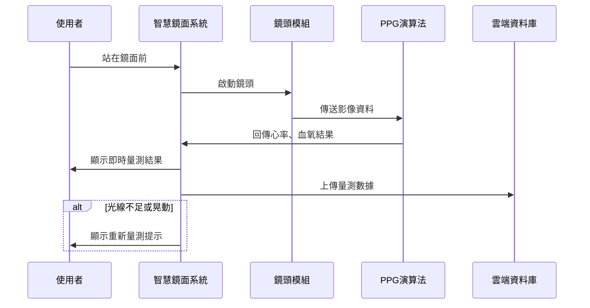
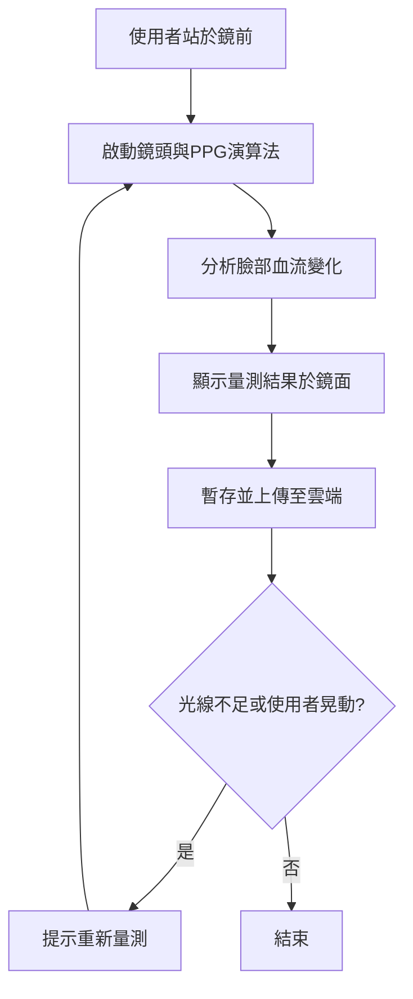
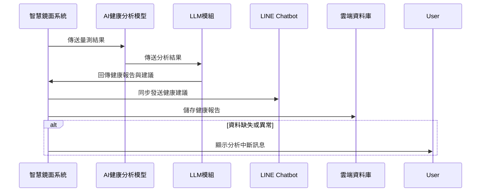
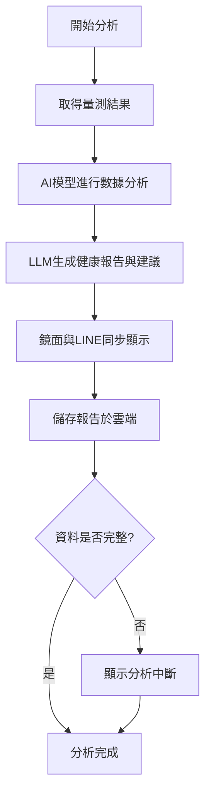
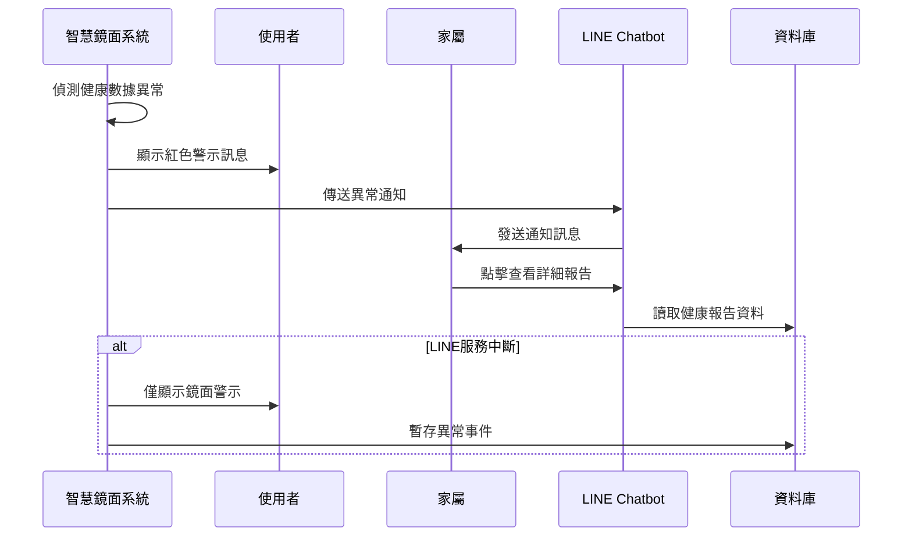
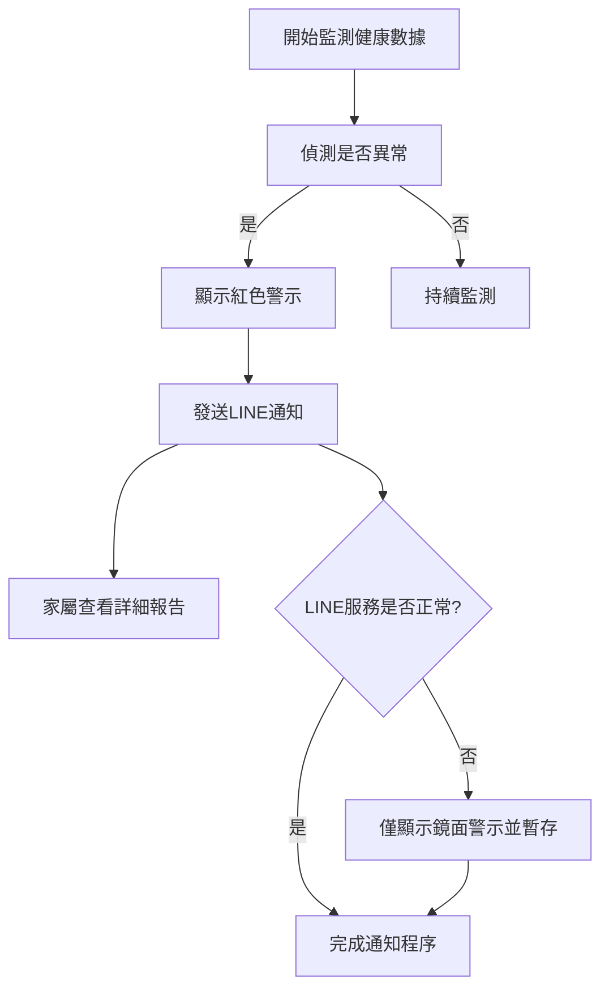

### 一、生理數據偵測（PPG影像量測）
#### 循序圖（Sequence Diagram）

#### 活動圖（Activity Diagram）

### 二、健康分析與建議（AI + LLM）
#### 循序圖（Sequence Diagram)

#### 活動圖（Activity Diagram）

### 三、異常警示與通知
#### 循序圖（Sequence Diagram)

#### 活動圖（Activity Diagram）

